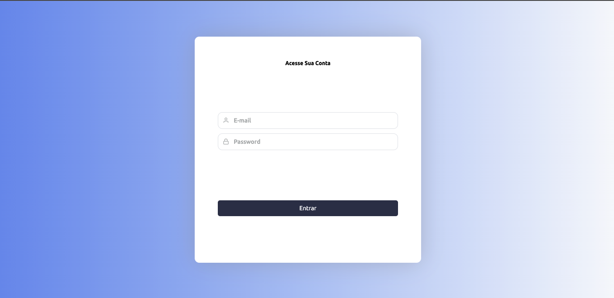

<div style="text-align: center; width: 100%;">

# Dragons Code

</div>


# Tabela de Conteúdos
- Telas
- Inicialização
- Instalação
- Primeiros passos
- Estrutura
- Tecnologias


# Telas

Inicialmente quando rodar a aplicacao ira cair nessa tela de login , somente ira ser aprovado o payload

```
email: teste@sicredi.com
senha: teste123
```
Login


Tela de Listagem de Dragoes

Home


Tela de Registro de Dragoes

Register


Informacao de Dragoes


Modal de editar dragao e excluir Dragao.
<div style="display:flex;">
    
    
</div>

Responsive Menu


#  Instalação

Inicialmente você deve ter em sua máquina [NodeJS](https://nodejs.org/en/), [Yarn](https://yarnpkg.com/), [Git](https://git-scm.com/) e então use um dos comandos abaixo para clonar este repositório:

Se estiver usando HTTPS:

`git clone https://github.com/Vicenteefenequis/Dragons.git`

Se estiver usando SSH:

`git clone git@github.com:Vicenteefenequis/Dragons.git`


e após isso executar

`yarn`

#  Primeiros passos

Extensões recommendadas VSCode:

- [Eslint](https://marketplace.visualstudio.com/items?itemName=dbaeumer.vscode-eslint)
- [Prettier](https://marketplace.visualstudio.com/items?itemName=esbenp.prettier-vscode)
- [Prettier-eslint](https://marketplace.visualstudio.com/items?itemName=rvest.vs-code-prettier-eslint)
- [Editor config](https://marketplace.visualstudio.com/items?itemName=EditorConfig.EditorConfig)


Após os passos de [instalação](#construction_worker-instalação) você deve acessar a pasta raiz do projeto e usar o comando:

`yarn start`

#  Estrutura

##  Diretórios

```
src/
  styles/
  hooks/
  components/
  pages/
  routes/
  store/
    modules/
  repositories/
  utils/
```

##  Tecnologias

- sass;
- redux;
- redux-saga;


##  Redux + Redux Saga

Dentro de `store` há a seguinte estrutura de diretórios e arquivos:

```
store/
  modules/
    example/
      actions.ts
      index.ts
      reducer.ts
      saga.ts
      types.ts
    rootReducer.ts
    rootSaga.ts
    rootTypes.ts
  index.ts
```

- `store/index.ts` é responsável por criar e exportar o store;
- `store/modules/rootReducer.ts` é responsável por combinar os reducers dos modules subsequentes e exportar um único reducer central para o store;
- `store/modules/rootSaga.ts` é semelhante ao `rootReducer.ts` porém sua entidade é o saga de cada modulo;
- `store/modules/rootTypes` é responsável por qualquer tipo de tipagem compartilhada entre todos os módulos e pelos `Roots`;
- `store/modules/example`
  - `actions.ts` responsável pela declaração das actions do módulo;
  - `index.ts` responsável pela exportação centralizada do módulo;
  - `reducer.ts` responsável pelo controle de estado do módulo. Logo, mutações de estado devem ficar neste arquivo;
  - `saga.ts` responsável por side effects em estados. Qualquer tipo de mutação de estado assíncrono deve resgatar os dados para o payload dentro do saga antes de disparar (dispatch) uma action. Actions assíncronas devem ser compostas por uma estrutura de 3 actions:
    - `@module/ACTION_REQUEST`;
    - `@module/ACTION_SUCCESS`;
    - `@module/ACTION_FAILURE`;
  - `types.ts` responsável pela tipagem de `actions`, `reducer states` e `payloads`;
    - Toda action deve extender a `rootType ActionReturnType<A, T>`;

##  Escrita de tipagem

Em `store/modules/rootTypes.ts` há um tipo que deve ser extendido para cada action em cada módulo.

A estrutura de `ActionReturnType<A, T>` é a seguinte:

```ts
export type ActionReturnType<A = string, T = any> = {
  type: A;
  payload: T;
};
```

onde `A` é sua action type `@module/EXAMPLE` e `T` é o tipo do que virá através do payload:

```ts
export type PayloadExample = {
  any_object: {
    any_data: any;
    any_other_data: any[];
  };
  any_array: any[];
};
```

O resultado final da action dentro do módulo, seria algo como:

```ts
export type ExampleAction = ActionReturnType<'@module/EXAMPLE', PayloadExample>;
```

**Para cada novo módulo deve ser adicionado ao RootState o Tipo do Estado do novo módulo:**

`store/modules/newExample`

agora com o novo módulo `newExample`, `interface RootState` deve estar dessa forma:

```ts
export interface RootState {
  example: ExampleState;
  newExample: NewExampleState;
}
```

###  Questões ocasionais

- Por que há um `index.ts` dentro de algumas pastas?

R: Para exportação. Este index deve conter a exportação de componentes e afins das subpastas daquele modulo.

Exemplo:

```
pages/
  profile/
  dragons/
  index.ts
```

Conteúdo `index.ts`:

```ts
export { default as Dragons } from './Dragons';
export { default as Home } from './Home';
```


